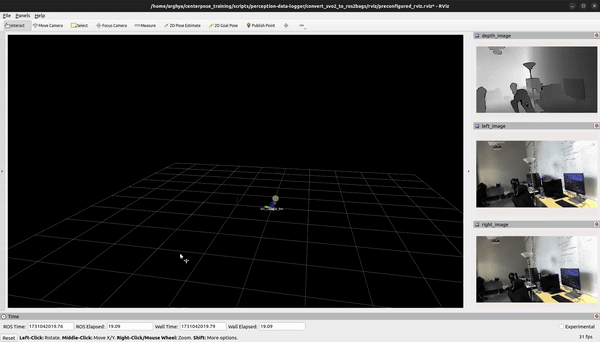

# Point Cloud Inspector
A point cloud inspection tool w/o texture in .bin or .pcd and .ply (KITTI format), sensor_msgs / PointCloud2 messages (ROS1/ROS2 format).

# Setup
## System Requirements
For this demo, we are using Ubuntu 22.04, ROS2 (ROS Humble), Nvidia Driver 535, Cuda 12.1 and ZED SDK 4.1.2 (pyzed-4.1) and python 3.10. 

## Clone the repo:
```bash
git clone https://github.com/ArghyaChatterjee/point_inspector.git
cd point_inspector/
```

## Create a Virtualenv:
```bash
# To access python3-pcl functionalities from system installation
python3 -m venv --system-site-packages point_inspector_venv
source point_inspector_venv/bin/activate
source /opt/ros/humble/setup.bash 
## ignore these steps if your system already have them
pip3 install --upgrade pip
pip3 install -r requirements.txt
```
## Install libraries from apt
```bash
sudo apt install ros-humble-vision-opencv ros-humble-cv-bridge ros-humble-sensor-msgs-py ros-humble-pcl-ros pcl-tools python3-pcl
```

# ZED Point Cloud Inpection 
## Point Cloud With Texture Inspection in KITTI (.bin or .pcd) Format:

A `.bin` file **can** encode RGB values, similar to `.ply` files, but it depends entirely on the format specification used when generating the `.bin` file. Unlike the `.ply` format, which has a well-defined ASCII or binary structure for encoding vertices and color information, `.bin` files are raw binary data without a universal standard for point cloud data. This means:

- **Structure Variability**: `.bin` files can store data in any arbitrary structure, including `(x, y, z, r, g, b)` or `(x, y, z, intensity)`, among others. The structure is determined by the tool or library that created the file.

- **KITTI Format Convention**: In the context of the KITTI dataset (a popular format for autonomous driving data), `.bin` files usually encode points in the form `(x, y, z, intensity)`, where each field is a 4-byte float. RGB values aren’t included in this standard. Some datasets that build on KITTI might add color, but the basic KITTI `.bin` structure does not include it.

- **Custom `.bin` Formats with RGB**: If you know that RGB values are stored, the structure might be `(x, y, z, r, g, b)` or `(x, y, z, rgba)` where:
  - `(x, y, z, r, g, b)`: Here, `r`, `g`, and `b` are usually stored as integers or floats, making a total of 24 bytes per point (for 4-byte floats).
  - `(x, y, z, rgba)`: The RGB values could be packed into a single float (`rgba`), with each color channel taking 8 bits (as in 32-bit color encoding).

### Check RGB in a `.bin` File
To confirm if a `.bin` file includes RGB:
1. **Look at the File Size**: Calculate the expected file size per point. For instance:
   - `(x, y, z, intensity)`: 16 bytes per point (4 x 4-byte floats)
   - `(x, y, z, r, g, b)`: 24 bytes per point (if each is a 4-byte float)
   - `(x, y, z, rgba)`: 16 bytes per point (with `rgba` as a 4-byte float)

2. **Read and Interpret Data in Chunks**: Start by reading a few sample points with various structures to see if they yield realistic values.

### Check No. of Point Clouds
```bash
cd scripts
python3 count_one_point_no_from_bin_files.py
```
### Inspect Point Clouds
```bash
cd scripts
python3 inspect_point_cloud.py
```
Output is something like this:
```

```

```bash
python3 inspect_point_cloud_2.py
```
Output is something like this:
```

```
```bash
python3 inspect_point_cloud_2.py
```
Output is something like this:
```

```

<div align="center">
  
</div>

# ZED Point Cloud Inpection 
## Point Cloud With Texture Inspection in .ply Format:

A `.bin` file **can** encode RGB values, similar to `.ply` files, but it depends entirely on the format specification used when generating the `.bin` file. Unlike the `.ply` format, which has a well-defined ASCII or binary structure for encoding vertices and color information, `.bin` files are raw binary data without a universal standard for point cloud data. This means:

- **Structure Variability**: `.bin` files can store data in any arbitrary structure, including `(x, y, z, r, g, b)` or `(x, y, z, intensity)`, among others. The structure is determined by the tool or library that created the file.

- **KITTI Format Convention**: In the context of the KITTI dataset (a popular format for autonomous driving data), `.bin` files usually encode points in the form `(x, y, z, intensity)`, where each field is a 4-byte float. RGB values aren’t included in this standard. Some datasets that build on KITTI might add color, but the basic KITTI `.bin` structure does not include it.

- **Custom `.bin` Formats with RGB**: If you know that RGB values are stored, the structure might be `(x, y, z, r, g, b)` or `(x, y, z, rgba)` where:
  - `(x, y, z, r, g, b)`: Here, `r`, `g`, and `b` are usually stored as integers or floats, making a total of 24 bytes per point (for 4-byte floats).
  - `(x, y, z, rgba)`: The RGB values could be packed into a single float (`rgba`), with each color channel taking 8 bits (as in 32-bit color encoding).

### How to Check RGB in a `.bin` File
To confirm if a `.bin` file includes RGB:
1. **Look at the File Size**: Calculate the expected file size per point. For instance:
   - `(x, y, z, intensity)`: 16 bytes per point (4 x 4-byte floats)
   - `(x, y, z, r, g, b)`: 24 bytes per point (if each is a 4-byte float)
   - `(x, y, z, rgba)`: 16 bytes per point (with `rgba` as a 4-byte float)

2. **Read and Interpret Data in Chunks**: Start by reading a few sample points with various structures to see if they yield realistic values.

```bash
cd scripts
python3 inspect_point_cloud.py
```
Output is something like this:
```

```

```bash
python3 inspect_point_cloud_2.py
```
Output is something like this:
```

```
```bash
python3 inspect_point_cloud_2.py
```
Output is something like this:
```

```

<div align="center">
  
</div>

# ZED Point Cloud Inpection 

## What's the difference between a camera frame and an optical frame ?
In ROS, the traditional frame convention is x forward, y left and z up. For depth images and pointclouds, z needs to be in the forward frame and the traditional ros convention doesn't support. So, you will see there is a new frame called optical frame that has been introduced and optical frames (left and right) are rotated than normal camera frame in ROS so that they become z forward, x right and y down.

## Point Cloud With Texture Inspection in ROS2 Format:
### Check No. of Point Clouds
```bash
cd scripts
python3 count_one_point_no_from_ros2_topic.py
```


# Lidar Point Cloud Inpection 
## Point Cloud Without Texture Inspection in ROS2 format:
```bash
# ROS1
rosrun point_inspector point_inspector_node points:=/os1_cloud_node1/points

# ROS2
ros2 run point_inspector point_inspector_node -r points:=/os1_cloud_node1/points
```

Output example:
```
--- points ---
frame_id:laser_data_frame
stamp   :1670294980 379087360
size    :512 x 128
x              : datatype=FLOAT32 mean=3.894 first=-0.000 last=-0.000 median=0.000 min=-5.003 max=53.615
y              : datatype=FLOAT32 mean=0.245 first=0.000 last=-0.000 median=0.000 min=-98.566 max=138.273
z              : datatype=FLOAT32 mean=0.406 first=0.000 last=-0.000 median=-0.000 min=-2.003 max=15.989
intensity      : datatype=FLOAT32 mean=120.222 first=0.000 last=0.000 median=4.000 min=0.000 max=9207.000
t              : datatype=UINT32 mean=1352700063.0 first=2690838016 last=2690838016 median=49959936 min=0 max=2690838016
reflectivity   : datatype=UINT16 mean=5.4 first=0 last=0 median=0 min=0 max=184
ring           : datatype=UINT8 mean=63.5 first=0 last=127 median=64 min=0 max=127
ambient        : datatype=UINT16 mean=391.8 first=0 last=0 median=293 min=0 max=6605
range          : datatype=UINT32 mean=6368.6 first=0 last=0 median=0 min=0 max=138284
```

## Docker images

- [arghya/point_inspector:noetic ](https://hub.docker.com/repository/docker/arghya/points_inspector)
- [arghya/point_inspector:humble ](https://hub.docker.com/repository/docker/arghya/point_inspector)

```bash
# ROS1 noetic
docker run --rm --net host arghya/point_inspector:noetic rosrun point_inspector point_inspector_node points:=/os1_cloud_node1/points
```

```bash
# ROS2 humble (You may need some DDS configuration for ROS2 communication over docker)
docker run --rm arghya/point_inspector:humble ros2 run point_inspector point_inspector_node -r points:=/os1_cloud_node1/points
```

<div align="center">
  
</div>

# Lidar Point Cloud Inpection 
## Point Cloud Without Texture Inspection in KITTI (.bin or .pcd) format:
KITTI lidar files (.bin or .pcd) are 10 times reduced in terms of no. of point clouds as well as size (MB) as compared to zed (or any rgbd sensor) generated point clouds. 
```bash
# ROS1
rosrun point_inspector point_inspector_node points:=/os1_cloud_node1/points

# ROS2
ros2 run point_inspector point_inspector_node -r points:=/os1_cloud_node1/points
```

Output example:
```
--- points ---
frame_id:laser_data_frame
stamp   :1670294980 379087360
size    :512 x 128
x              : datatype=FLOAT32 mean=3.894 first=-0.000 last=-0.000 median=0.000 min=-5.003 max=53.615
y              : datatype=FLOAT32 mean=0.245 first=0.000 last=-0.000 median=0.000 min=-98.566 max=138.273
z              : datatype=FLOAT32 mean=0.406 first=0.000 last=-0.000 median=-0.000 min=-2.003 max=15.989
intensity      : datatype=FLOAT32 mean=120.222 first=0.000 last=0.000 median=4.000 min=0.000 max=9207.000
t              : datatype=UINT32 mean=1352700063.0 first=2690838016 last=2690838016 median=49959936 min=0 max=2690838016
reflectivity   : datatype=UINT16 mean=5.4 first=0 last=0 median=0 min=0 max=184
ring           : datatype=UINT8 mean=63.5 first=0 last=127 median=64 min=0 max=127
ambient        : datatype=UINT16 mean=391.8 first=0 last=0 median=293 min=0 max=6605
range          : datatype=UINT32 mean=6368.6 first=0 last=0 median=0 min=0 max=138284
```

## Docker images

- [arghya/point_inspector:noetic ](https://hub.docker.com/repository/docker/arghya/points_inspector)
- [arghya/point_inspector:humble ](https://hub.docker.com/repository/docker/arghya/point_inspector)

```bash
# ROS1 noetic
docker run --rm --net host arghya/point_inspector:noetic rosrun point_inspector point_inspector_node points:=/os1_cloud_node1/points
```

```bash
# ROS2 humble (You may need some DDS configuration for ROS2 communication over docker)
docker run --rm arghya/point_inspector:humble ros2 run point_inspector point_inspector_node -r points:=/os1_cloud_node1/points
```

<div align="center">
  
</div>

# Resources
- https://github.com/SebastianGrans/ROS2-Point-Cloud-Demo
- https://github.com/koide3/points_inspector
